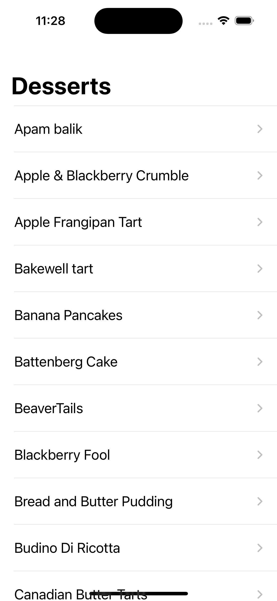
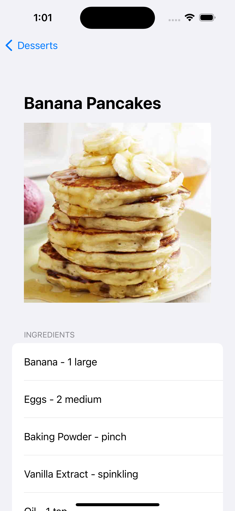

# Desserts List

## Table of Contents
1. [Summary](#summary)
  - [Dessert List Endpoint](#dessert-list-endpoint)
  - [Dessert Details Endpoint](#dessert-details-endpoint)
2. [Architectural Approach](#architectural-approach)
3. [Dessert List View](#dessert-list-view)
4. [Dessert View](#dessert-view)

## Summary
Purpose of this coding challenge is the following:
1. Fetch desserts from Meal Database API, then display list of desserts alphabetically
2. Fetch dessert details and display its name, image, ingredients with measurement, and instructions.

Before jumping into coding, I made sure to fully understand the requirements and given REST endpoints.

<br />

### Dessert List Endpoint
By calling the [Dessert List Endpoint](https://themealdb.com/api/json/v1/1/filter.php?c=Dessert), it returns a list of desserts in the following response:
```
{
    "meals": [
        {
            "strMeal": "Apam balik",
            "strMealThumb": "https://www.themealdb.com/images/media/meals/adxcbq1619787919.jpg",
            "idMeal": "53049"
        },
      ......
    ]
}
```

It appears to return desserts in alphabetical order, *but just to be extra safe* I'll sort the list of desserts alphabetically within the iOS app.

<br />

### Dessert Details Endpoint
By requesting dessert details for a specific dessert via the [Dessert Details Endpoint](https://themealdb.com/api/json/v1/1/lookup.php?i=52924), it returns the following response:
```
{
    "meals": [
        {
            "idMeal": "52924",
            "strMeal": "Nanaimo Bars",
            "strDrinkAlternate": null,
            "strCategory": "Dessert",
            "strArea": "Canadian",
            "strInstructions": "Start by making the biscuit base. In a bowl, over a pan of simmering water, melt the butter with the sugar and cocoa powder, stirring occasionally until smooth. Whisk in the egg for 2 to 3 mins until the mixture has thickened. Remove from heat and mix in the biscuit crumbs, coconut and almonds if using, then press into the base of a lined 20cm square tin. Chill for 10 mins.\r\nFor the middle layer, make the custard icing; whisk together the butter, cream and custard powder until light and fluffy, then gradually add the icing sugar until fully incorporated. Spread over the bottom layer and chill in the fridge for at least 10 mins until the custard is no longer soft.\r\nMelt the chocolate and butter together in the microwave, then spread over the chilled bars and put back in the fridge. Leave until the chocolate has fully set (about 2 hrs). Take the mixture out of the tin and slice into squares to serve.",
            "strMealThumb": "https://www.themealdb.com/images/media/meals/vwuprt1511813703.jpg",
            "strTags": "Treat,Snack,Dairy",
            "strYoutube": "https://www.youtube.com/watch?v=MMrE4I1ZtWo",
            "strIngredient1": "Custard",
            "strIngredient2": "Caster Sugar",
            "strIngredient3": "Cocoa",
            "strIngredient4": "Egg",
            "strIngredient5": "Digestive Biscuits",
            "strIngredient6": "Desiccated Coconut",
            "strIngredient7": "Almonds",
            "strIngredient8": "Butter",
            "strIngredient9": "Double Cream",
            "strIngredient10": "Custard Powder",
            "strIngredient11": "Icing Sugar",
            "strIngredient12": "Dark Chocolate",
            "strIngredient13": "Butter",
            "strIngredient14": "",
            "strIngredient15": "",
            "strIngredient16": "",
            "strIngredient17": "",
            "strIngredient18": "",
            "strIngredient19": "",
            "strIngredient20": "",
            "strMeasure1": "125g",
            "strMeasure2": "50g",
            "strMeasure3": "5 tbs",
            "strMeasure4": "1 beaten",
            "strMeasure5": "200g shredded",
            "strMeasure6": "100g ",
            "strMeasure7": "50g",
            "strMeasure8": "100g ",
            "strMeasure9": "4 tbs",
            "strMeasure10": "3 tbs",
            "strMeasure11": "250g",
            "strMeasure12": "150g",
            "strMeasure13": "50g",
            "strMeasure14": "",
            "strMeasure15": "",
            "strMeasure16": "",
            "strMeasure17": "",
            "strMeasure18": "",
            "strMeasure19": "",
            "strMeasure20": "",
            "strSource": "https://www.bbcgoodfood.com/recipes/nanaimo-bars",
            "strImageSource": null,
            "strCreativeCommonsConfirmed": null,
            "dateModified": null
        }
    ]
}
```

Some things I'll have to keep in mind before development is the following:
- I can pass the dessert `id` via the URL parameter to fetch its details.
- `strInstructions` contains dessert instructions, but it needs formatting on the client side to beautifully present instructions to the user.
- Each `strIngredient` is accompanied by `strMeasure`. For example, `strIngredient1` and `strMeasure1` together is **Custard, 125g**. Hence I'll need to also format this data on the client so it's presented elegantly in the UI.

<br />

## Architectural Approach
Time to think about app architecture. I decided to go with the **MVVM (Model, View, View Model)** architecture for the following reasons:
- Ideal separation of concerns between modules.
- The UI will focus on simply displaying data
- The View Model will handle the logic and facilitate communication between the View and API module
- Since the ViewModel will be the source of the logic, I can make use of Swift `protocols` to abstract them using the `Factory Pattern` principle.

For the **Model**, I'll use the `Codable` protocol to seamlessly decode API responses into Swift models.

For networking, I'll be using a `MealAPI` to handle Meal endpoint requests. I'll also be using `ImageLoader` to handle downloading and caching dessert images. Both network components are abstracted using the Factory design pattern by using Swift protocols. 

Taking performance into account, I'll be doing the following to reduce network calls:
- Fetch list of desserts **only once**
- Fetch dessert details **only once when requested by user**. If user views same dessert a second time, **no extra network calls are executed** since it was already fetched.
- Utilizing an `ImageLoader` to handle downloading and caching dessert images. The image is fetched when user views dessert details.


<br />

## Dessert List View
`DessertListView` is a SwiftUI view utilizing `List`to display all desserts in alphabetical order. Each cell simply displays the dessert name. 



<br />

## Dessert View
As with the previous view `DessertView` is a SwiftUI view utilizing `List` to display dessert's name, ingredients with corresponding measurements, and instructions. 



<br />